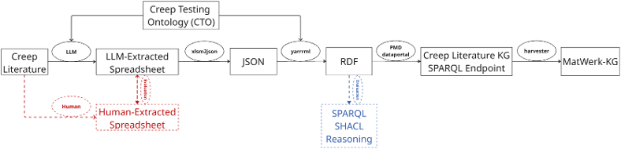

# Pipeline



The end-to-end workflow converts creep metadata from scientific publications into validated, ontology-grounded RDF and publishes it on the MaterialDigital Dataportal.

## Population workflow

```
new creep paper
   → LLM4CreepLitKG (LLM extraction, under development) / human extraction
   → data checked by a human and added to creep_literature_spreadsheet.xlsm
   → ./map.sh  (4-step pipeline)
   → creep_literature_rdf.ttl
   → MaterialDigital Dataportal
   → public SPARQL endpoint
   → harvested into MatWerk-KG
```

Metadata is currently extracted from publications manually into a structured spreadsheet template. The **LLM4CreepLitKG** component will automate this extraction step; its output will always be validated by a human against the same spreadsheet template before entering the pipeline, so the downstream steps are identical for both extraction routes.

## The four-step `map.sh` pipeline

Running `./map.sh` (optionally with a spreadsheet filename as argument) executes the whole pipeline for the entire spreadsheet in one command:

### Step 1 — Spreadsheet → JSON (`xlsm2json.py`)

A generic Python converter reads the single machine-readable header row of `creep_literature_spreadsheet.xlsm` and produces **one JSON array** (`creep_literature_metadata.JSON`) with one object per data row. The converter is purely syntactic and contains **no ontology knowledge**:

- Cells in `number unit` format (e.g. `625 MPa`, `650 °C`, `170 µm`) become `{"value", "unit", "unit_iri"}` objects, with QUDT unit IRIs resolved via a lookup table.
- Values containing uncertainty or qualifiers (`159.74 ±19.18 h`, `< 0.02`) and descriptive text become `{"text": ...}` literals, preserved verbatim rather than lossily coerced.
- Empty cells are omitted entirely, so absent parameters generate no triples.
- Every parameter object carries an injected `"id"` copied from the mandatory `ID` column. YARRRML subject templates use `$(param.id)`, so a row where a parameter is absent silently generates **no** triples for that parameter — zero orphan triples, without any conditional mapping logic.

### Step 2 — YARRRML → RML (`yarrrml-parser`)

The declarative mapping `creep_literature_mapping.yaml` holds **all** semantic decisions: every class and property IRI, sourced exclusively from `cto.ttl` and the ontologies CTO reuses. It is converted to executable RML rules (`temp_rml.ttl`) using the Dockerized `rmlio/yarrrml-parser:1.10.0`.

### Step 3 — JSON + RML → RDF (`rmlmapper`)

The Dockerized `rmlio/rmlmapper-java:v7.3.3` executes the RML rules over the JSON and produces `creep_literature_rdf.ttl`. Subject IRIs follow the deterministic pattern `msekg:<entity>_$(id)`, minted from the spreadsheet `ID` column. Re-running the pipeline after new rows are added is therefore **safe and idempotent**: existing rows regenerate identical triples.

### Step 4 — SHACL validation (`pySHACL`)

Five SHACL shapes in the `shapes/` folder are executed against the output. The runner loops over all `shapes/shape*.ttl` files so every shape is checked, and the script exits non-zero on any violation — a defective graph is never mistaken for a successful run and never loaded into the triple store.

## Running it yourself

**Requirements:** `python3` with `openpyxl` and `pyshacl`, and Docker (the YARRRML parser and RML mapper run as containers, so no local Java/Node installation is needed).

```bash
# default spreadsheet (creep_literature_spreadsheet.xlsm)
./map.sh
```

## Design principles

1. **Strict separation of concerns** — Python handles syntax (cell parsing, unit lookup); the YAML mapping holds all ontology semantics.
2. **One JSON array per run** rather than one file per row, keeping the mapping simple and the process scalable.
3. **Deterministic, ID-derived IRIs** for idempotent, safely repeatable runs.
4. **Validation as a gate** — SHACL conformance is a hard requirement before any triple-store load.
5. **Text-literal fallback** — values that cannot be cleanly parsed as a number plus unit (uncertainties, ranges, qualitative descriptions) are preserved verbatim.

